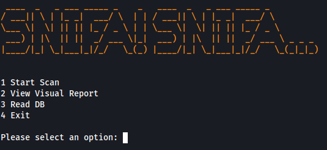

# SNIFA! SNIFA...

## Disclaimer
This project is for testing and educational purposes. Use it only against your own networks and devices. I don't take any responsibility for what you do with this program.

## Description
SNIFA! SNIFA... is a Python program for network scanning using the Nmap tool.
It allows users to perform host/network and port scans, retrieve information about live hosts, and save scan results to a SQLite database.

## Dependencies

Before running this program, ensure that you have the following dependencies installed:

- [python-nmap](https://pypi.org/project/python-nmap/)
- [pysqlite3](https://pypi.org/project/pysqlite3/)
- [pycvesearch](https://pypi.org/project/pycvesearch/)
- [scapy](https://pypi.org/project/scapy/)

You can install these dependencies using pip:

`pip install python-nmap pysqlite3 pycvesearch scapy`

## Installation
1. Clone the repository:

`git clone https://github.com/yourusername/snifa.git`

`cd snifa`

## Usage
To start the program: (sudo is needed for all features to work)

`sudo python snifa.py`

